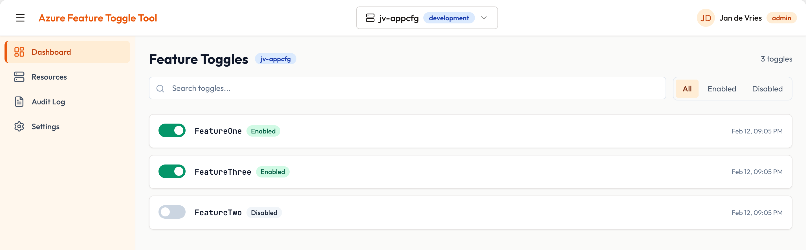
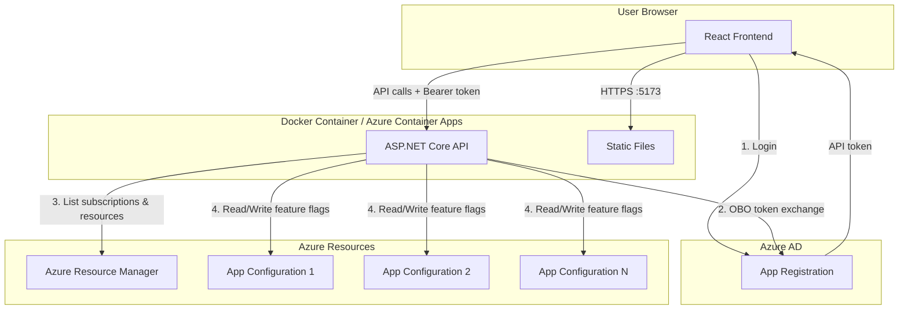
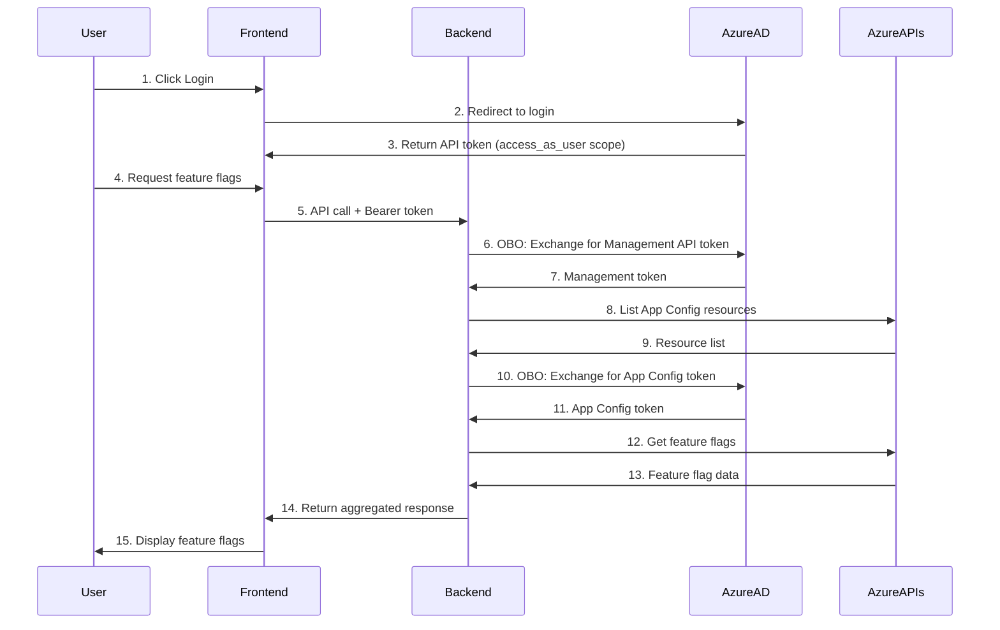
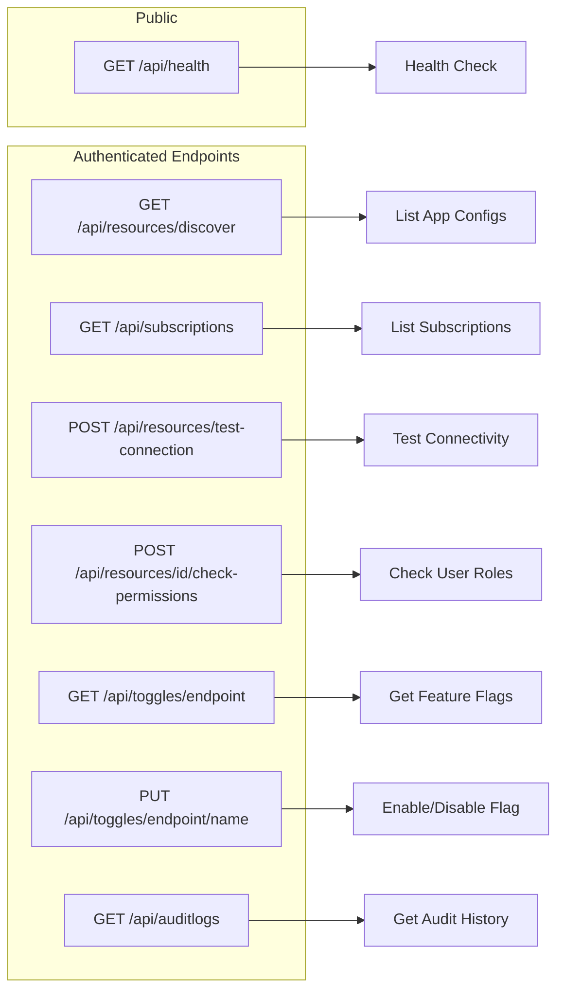
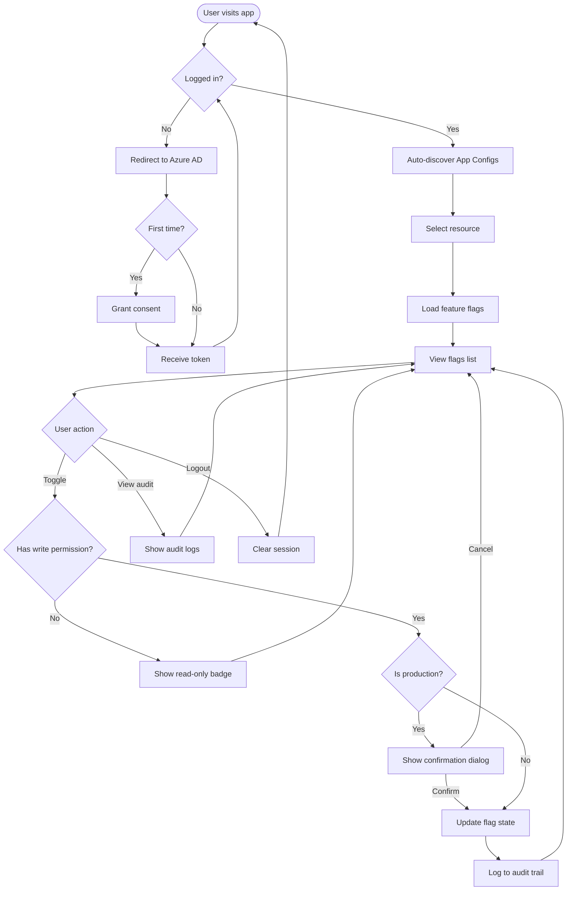

# Azure Feature Toggle Manager

A web application for managing Azure App Configuration feature flags. Auto-discovers resources, provides toggle management with audit logging, and uses Azure RBAC for access control.

> **Note**: This project was generated using [DesignOS](https://buildermethods.com/design-os). Design artifacts are in the `product-plan/` folder.

## Screenshot



The dashboard provides a unified interface for managing feature flags across your Azure App Configuration resources:

- **Automatic Resource Discovery**: On login, the app automatically discovers all Azure App Configuration resources you have access to across your subscriptions.
- **Resource Selection**: Use the dropdown at the top to switch between different App Configuration resources. The environment badge (e.g., "development") helps identify the resource context.
- **Feature Toggle Management**: View all feature flags with their current state (Enabled/Disabled). Toggle flags on or off with a single click.
- **Audit Log**: Navigate to the Audit Log page to view the complete history of changes, including who made each change and when.

## Features

- Auto-discover Azure App Configuration resources across subscriptions
- Toggle feature flags with single-click enable/disable
- Production safeguards with confirmation dialogs
- Audit logging of all changes
- Role-based access via Azure RBAC

## Tech Stack

| Layer      | Technology                                          |
| ---------- | --------------------------------------------------- |
| Frontend   | React 18, TypeScript, Vite, Tailwind CSS, shadcn/ui |
| Backend    | ASP.NET Core 10.0 (C#)                              |
| Auth       | Azure AD, MSAL.js, OBO flow                         |
| Deployment | Single Docker container or Azure Container Apps     |

## Architecture Overview



## Authentication Flow

The application uses the OAuth 2.0 On-Behalf-Of (OBO) flow for secure delegated access:



**Key Points:**

- Frontend acquires only ONE token (`api://{client-id}/access_as_user`)
- Backend exchanges this token via OBO for Azure Management and App Configuration tokens
- User's permissions are preserved through the entire flow (delegated access)

## API Endpoints



## Prerequisites

- Docker (recommended) or Node.js 20+ / .NET 10 SDK
- Azure AD App Registration
- Azure App Configuration resource(s)

## Azure Setup

### App Registration

1. Create a new App Registration in Azure AD
2. Configure:

**Redirect URIs (SPA):**

- `http://localhost:5173`

**Expose an API:**

- URI: `api://{client-id}`
- Scope: `access_as_user`

**API Permissions (Delegated):**

| API                      | Permission                                |
| ------------------------ | ----------------------------------------- |
| Microsoft Graph          | `User.Read`, `openid`, `profile`, `email` |
| Azure Service Management | `user_impersonation`                      |
| Azure App Configuration  | `KeyValue.Read`, `KeyValue.Write`         |

**Client Secret:**

- Create one (required for OBO flow)

**Grant admin consent** for all permissions.

### Required Azure Roles

| Role                          | Scope               | Purpose                       |
| ----------------------------- | ------------------- | ----------------------------- |
| Reader                        | Subscription        | Discover App Config resources |
| App Configuration Data Reader | App Config resource | Read feature flags            |
| App Configuration Data Owner  | App Config resource | Read/write feature flags      |

## Quick Start

### Docker (Recommended)

```bash
# Build
docker build -t azure-feature-toggle .

# Run
docker run -d -p 5173:5173 \
  -e AzureAd__TenantId=<tenant-id> \
  -e AzureAd__ClientId=<client-id> \
  -e AzureAd__ClientSecret=<client-secret> \
  -e AzureAd__Instance=https://login.microsoftonline.com/ \
  --name azure-feature-toggle \
  azure-feature-toggle
```

Open http://localhost:5173

### Deploy to Azure

See [terraform/README.md](terraform/README.md) for deploying to Azure Container Apps with:

- GitHub Container Registry (public image)
- Azure Key Vault (secure secret storage)
- Managed Identity
- Auto-created App Registration

**Manual deployment:**

```bash
cd terraform
cp terraform.tfvars.example terraform.tfvars
# Edit terraform.tfvars
terraform init && terraform apply
```

**CI/CD deployment:**

GitHub Actions workflows are available for automated deployments. See [CICD-SETUP.md](CICD-SETUP.md) for setup instructions.

### Local Development

**Frontend:**

```bash
cd frontend
cp .env.example .env.local
# Edit .env.local with your Azure AD settings
npm install && npm run dev
```

**Backend:**

```bash
cd backend
dotnet user-secrets set "AzureAd:TenantId" "<tenant-id>"
dotnet user-secrets set "AzureAd:ClientId" "<client-id>"
dotnet user-secrets set "AzureAd:ClientSecret" "<client-secret>"
dotnet run
```

## Environment Variables

| Variable                | Description                          | Required |
| ----------------------- | ------------------------------------ | -------- |
| `AzureAd__TenantId`     | Azure AD tenant ID                   | Yes      |
| `AzureAd__ClientId`     | App registration client ID           | Yes      |
| `AzureAd__ClientSecret` | Client secret for OBO flow           | Yes      |
| `AzureAd__Instance`     | `https://login.microsoftonline.com/` | Yes      |

## Project Structure

```
├── frontend/              # React + Vite
│   ├── src/
│   │   ├── components/    # UI components (shadcn/ui)
│   │   ├── context/       # Auth, Resources, Toggles state
│   │   └── lib/           # API client, auth config
│   └── .env.example
├── backend/               # ASP.NET Core API
│   ├── Controllers/       # REST endpoints
│   ├── Services/          # Azure SDK integration, OBO flow
│   └── appsettings.json
├── terraform/             # Infrastructure as Code
│   ├── *.tf               # Terraform configurations
│   └── README.md          # Deployment guide
├── product-plan/          # DesignOS design artifacts
├── Dockerfile             # Multi-stage build
└── README.md
```

## User Flow



## Security Considerations

- **No secrets in frontend**: Client secret is backend-only
- **Delegated access**: User's own permissions are enforced
- **RBAC**: Azure roles control read/write access
- **Audit logging**: All changes are tracked
- **HTTPS**: Enforced in production deployments

## License

MIT
