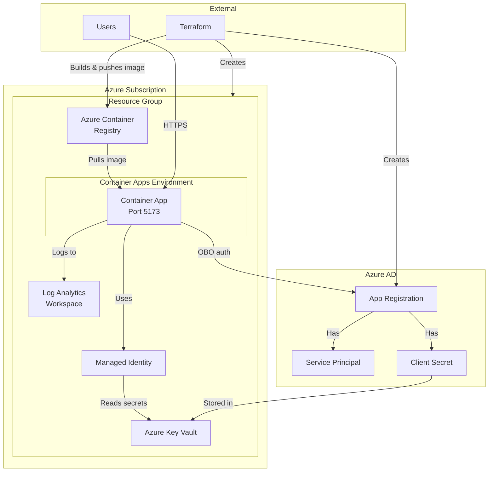
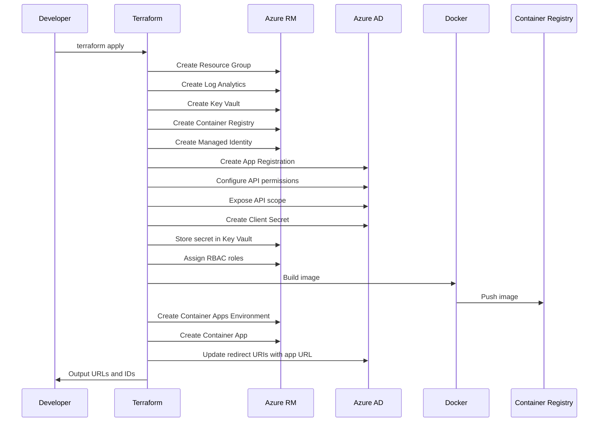
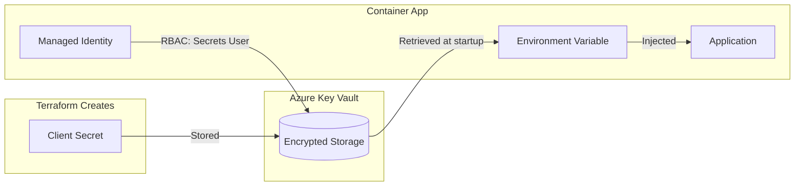
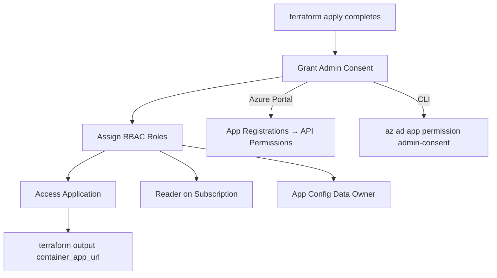
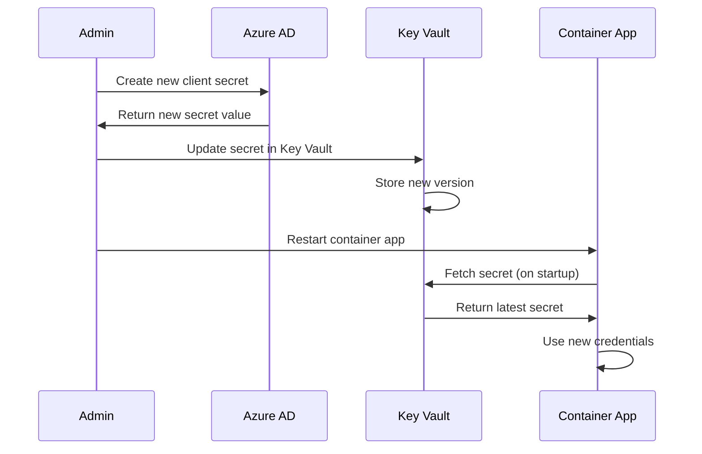
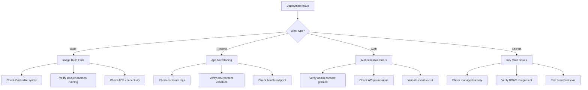
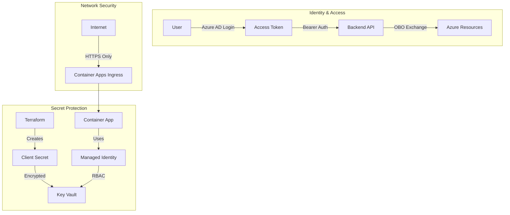

# Terraform Deployment for Azure Feature Toggle Manager

This Terraform configuration deploys the Azure Feature Toggle Manager application to Azure Container Apps with a complete Azure AD App Registration and secure secret management via Key Vault.

## What Gets Created

| Resource | Description |
|----------|-------------|
| Resource Group | Contains all resources |
| Azure Container Registry | Hosts the Docker image |
| Log Analytics Workspace | Required for Container Apps |
| Container Apps Environment | Hosting environment |
| Container App | The running application with HTTPS |
| Azure AD App Registration | With all required API permissions |
| Service Principal | For the app registration |
| Azure Key Vault | Secure storage for client secret |
| User-Assigned Managed Identity | For Container App to access Key Vault |
| Client Secret | For OBO flow (stored in Key Vault) |

## Infrastructure Architecture



## Deployment Flow



## Secret Management Flow



## Prerequisites

1. **Azure CLI** - [Install Azure CLI](https://docs.microsoft.com/en-us/cli/azure/install-azure-cli)
2. **Terraform** - [Install Terraform](https://www.terraform.io/downloads) (>= 1.5.0)
3. **Docker** - [Install Docker](https://docs.docker.com/get-docker/)

### Required Azure Permissions

Your Azure account needs:
- **Contributor** on the target subscription (for Azure resources)
- **Application Administrator** or **Global Administrator** in Azure AD (for App Registration)
- **Key Vault Administrator** role will be auto-assigned for secret management

## Quick Start

### 1. Login to Azure

```bash
# Login to Azure CLI
az login

# Set the subscription
az account set --subscription "your-subscription-id"
```

### 2. Configure Variables

```bash
cd terraform

# Copy the example variables file
cp terraform.tfvars.example terraform.tfvars

# Edit with your values
# Required: subscription_id, tenant_id
```

### 3. Initialize and Deploy

```bash
# Initialize Terraform
terraform init

# Preview changes
terraform plan

# Deploy
terraform apply
```

### 4. Post-Deployment Steps



**1. Grant Admin Consent** - Required for the app to work

Go to Azure Portal → Azure AD → App Registrations → Your App → API Permissions → Grant admin consent

Or use CLI:
```bash
az ad app permission admin-consent --id $(terraform output -raw client_id)
```

**2. Assign Azure RBAC Roles** to users who need access:
- **Reader** on subscription - for resource discovery
- **App Configuration Data Owner** on App Config resources - for toggle management

**3. Access the Application**
```bash
# Get the URL
terraform output container_app_url
```

## Configuration Options

### Required Variables

| Variable | Description |
|----------|-------------|
| `subscription_id` | Azure Subscription ID |
| `tenant_id` | Azure AD Tenant ID |

### Optional Variables

| Variable | Default | Description |
|----------|---------|-------------|
| `project_name` | `featuretoggle` | Project name for resource naming |
| `environment` | `dev` | Environment (dev/staging/prod) |
| `location` | `westeurope` | Azure region |
| `container_cpu` | `0.5` | CPU cores for the container |
| `container_memory` | `1Gi` | Memory for the container |
| `min_replicas` | `0` | Minimum replicas (0 = scale to zero) |
| `max_replicas` | `3` | Maximum replicas |
| `build_and_push_image` | `true` | Auto-build and push Docker image |
| `key_vault_purge_protection` | `false` | Enable purge protection (recommended for prod) |
| `key_vault_soft_delete_days` | `7` | Soft delete retention (7-90 days) |

## Key Vault Integration

The client secret for the Azure AD app is stored securely in Azure Key Vault:

- **Secret Name:** `azure-ad-client-secret`
- **Access Method:** User-assigned managed identity with "Key Vault Secrets User" role
- **Auto-rotation:** Update the secret in Key Vault; Container App will pick it up on next restart

### Secret Rotation Process



**Commands:**
```bash
# Create a new client secret in Azure AD
NEW_SECRET=$(az ad app credential reset \
  --id $(terraform output -raw client_id) \
  --query password -o tsv)

# Update the secret in Key Vault
az keyvault secret set \
  --vault-name $(terraform output -raw key_vault_name) \
  --name azure-ad-client-secret \
  --value "$NEW_SECRET"

# Restart the Container App to pick up the new secret
az containerapp revision restart \
  --name $(terraform output -raw container_app_name) \
  --resource-group $(terraform output -raw resource_group_name)
```

### Viewing Secret Metadata (not the value)

```bash
az keyvault secret show \
  --vault-name $(terraform output -raw key_vault_name) \
  --name azure-ad-client-secret \
  --query "{name:name, created:attributes.created, expires:attributes.expires}"
```

## Outputs

After deployment, these outputs are available:

```bash
# Get all outputs
terraform output

# Get specific values
terraform output container_app_url
terraform output client_id
terraform output key_vault_name
terraform output summary
```

## Updating the Deployment

### Update Application Code

```bash
# Rebuild and redeploy the container
terraform apply -var="container_image_tag=v1.0.1"

# Or force a rebuild with the same tag
terraform taint null_resource.docker_build_push[0]
terraform apply
```

### Update Infrastructure

```bash
# Modify terraform.tfvars or .tf files
terraform plan
terraform apply
```

## Destroying Resources

```bash
# Preview what will be destroyed
terraform plan -destroy

# Destroy all resources
terraform destroy
```

**Warning:** This will delete:
- All Azure resources
- The Azure AD App Registration
- The Docker image in ACR
- The Key Vault (soft-deleted, recoverable for `key_vault_soft_delete_days`)

**Note:** If `key_vault_purge_protection = true`, the Key Vault cannot be immediately purged and must wait for the retention period.

## Troubleshooting

### Common Issues



### Image Build Fails

```bash
# Build manually
cd ..
docker build -t test-build .

# Check for errors and fix
```

### Container App Not Starting

```bash
# Check container logs
az containerapp logs show \
  --name $(terraform output -raw container_app_name) \
  --resource-group $(terraform output -raw resource_group_name)
```

### Key Vault Access Issues

```bash
# Verify the managed identity has access
az role assignment list \
  --scope $(az keyvault show --name $(terraform output -raw key_vault_name) --query id -o tsv) \
  --assignee $(terraform output -raw managed_identity_client_id)

# Test secret access (requires Key Vault Secrets User role)
az keyvault secret show \
  --vault-name $(terraform output -raw key_vault_name) \
  --name azure-ad-client-secret
```

### Admin Consent Issues

If you don't have admin consent permissions:
1. Contact your Azure AD administrator
2. They can grant consent in the Azure Portal

### OBO Flow Errors

If authentication fails:
1. Verify admin consent was granted
2. Check the client secret is valid in Key Vault
3. Ensure all API permissions are correct
4. Check Container App logs for detailed error messages

## File Structure

```
terraform/
├── main.tf                    # Provider config, data sources
├── variables.tf               # Input variables
├── outputs.tf                 # Output values
├── resource-group.tf          # Resource group
├── acr.tf                     # Container Registry + image build
├── container-apps.tf          # Container Apps Environment + App
├── key-vault.tf               # Key Vault + managed identity
├── app-registration.tf        # Azure AD App Registration
├── terraform.tfvars.example   # Example variables
└── README.md                  # This file
```

## Security Model



### Security Features

| Feature | Implementation |
|---------|----------------|
| **Secret Storage** | Azure Key Vault with RBAC |
| **Secret Access** | User-assigned managed identity |
| **Audit Trail** | Key Vault access logs in Log Analytics |
| **Soft Delete** | Configurable retention (7-90 days) |
| **Purge Protection** | Optional, recommended for production |
| **Network** | HTTPS-only ingress |

### Production Recommendations

For production deployments:

```hcl
# terraform.tfvars for production
environment                  = "prod"
min_replicas                 = 1
key_vault_purge_protection   = true
key_vault_soft_delete_days   = 90
```

```hcl
# Use remote state
terraform {
  backend "azurerm" {
    resource_group_name  = "rg-terraform-state"
    storage_account_name = "stterraformstate"
    container_name       = "tfstate"
    key                  = "featuretoggle.tfstate"
  }
}
```

Additional recommendations:
- Use managed identity instead of ACR admin credentials
- Configure custom domain with managed certificate
- Enable diagnostic settings for all resources
- Set up Azure Monitor alerts for failures
- Consider Azure Private Link for Key Vault access
