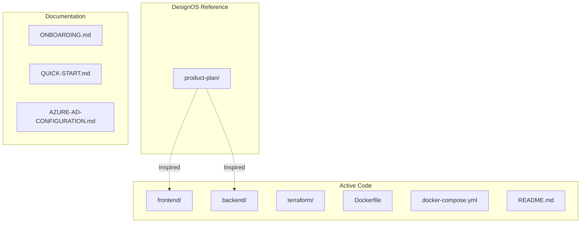

# What Is All This Content?

This document explains the purpose of every file and folder in this repository.

## Project Structure

## Active Application Code

### `frontend/` - React Application

The production frontend built with React 18, TypeScript, Vite, and Tailwind CSS.

| Folder | Purpose |
|--------|---------|
| `src/components/` | UI components (shadcn/ui based) |
| `src/context/` | React context providers (Auth, Resources, Toggles) |
| `src/lib/` | API client, auth configuration, utilities |
| `src/pages/` | Route components |

### `backend/` - ASP.NET Core API

The production backend built with ASP.NET Core 10.0 (C#).

| Folder | Purpose |
|--------|---------|
| `Controllers/` | REST API endpoints |
| `Services/` | Azure SDK integration, OBO token flow |
| `Models/` | Data transfer objects |

### `terraform/` - Infrastructure as Code

Terraform configurations for deploying to Azure Container Apps.

| File | Purpose |
|------|---------|
| `main.tf` | Provider configuration |
| `container-apps.tf` | Azure Container Apps deployment |
| `key-vault.tf` | Secret management |
| `app-registration.tf` | Azure AD app setup |
| `acr.tf` | Container Registry |
| `README.md` | Deployment guide |

### Root Configuration Files

| File | Purpose |
|------|---------|
| `Dockerfile` | Multi-stage build for the combined frontend + backend container |
| `docker-compose.yml` | Local development with Docker |
| `.gitignore` | Git ignore rules |
| `.dockerignore` | Docker build exclusions |

---

## Documentation Files

| File | Purpose |
|------|---------|
| `README.md` | Main project documentation |
| `ONBOARDING.md` | New developer setup guide |
| `QUICK-START.md` | Quick start for running locally |
| `AZURE-AD-CONFIGURATION.md` | Azure AD setup reference (contains specific tenant/app IDs) |
| `this file` | Explains repository contents |

---

## DesignOS Reference (`product-plan/`)

This folder was generated by [DesignOS](https://buildermethods.com/design-os) during the product planning phase. It contains design specifications that guided the implementation.

**Important:** These are *design artifacts*, not production code. They're reference material for understanding the original design intent.

### Contents

| Folder | Contents |
|--------|----------|
| `design-system/` | Color palette, typography, CSS tokens |
| `data-model/` | TypeScript types, sample data |
| `shell/` | Application shell component designs |
| `sections/` | Feature area designs (auth, resources, toggles, audit) |
| `instructions/` | Implementation guides |
| `prompts/` | AI agent prompts |

---

## Other Files

| File | Purpose |
|------|---------|
| `azure-feature-toggle-product.sln` | .NET solution file for IDE support |

---

## Summary

| Category | Folders/Files | Use |
|----------|---------------|-----|
| **Active Code** | `frontend/`, `backend/`, `terraform/`, `Dockerfile` | The actual application |
| **Documentation** | `README.md`, `ONBOARDING.md`, `QUICK-START.md`, `AZURE-AD-CONFIGURATION.md` | Setup and reference |
| **DesignOS Reference** | `product-plan/` | Design specs that guided implementation |
